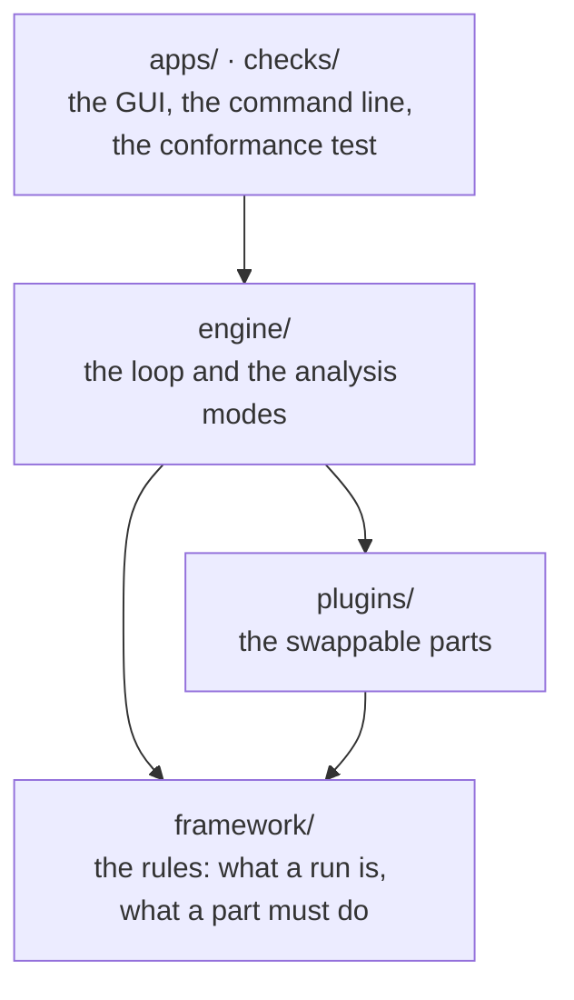
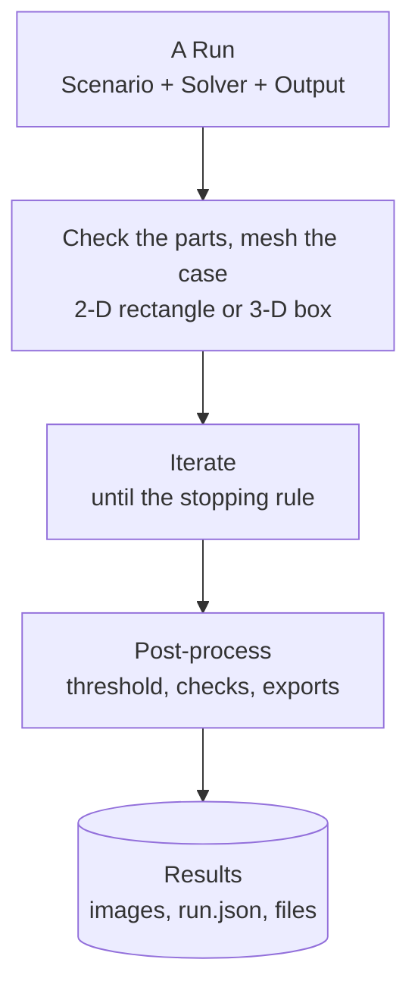

# `toporia` — the package

Toporia is a platform for topology optimisation in which **every choice is a swappable
part**: how the design is filtered, which physics is solved, what is minimised and
constrained, and how the design is updated. A run fixes the problem and names the parts;
the engine drives them all the same way, so two runs that differ in one part are a fair
comparison.

## Start here

Read in this order; each step is one folder and one README.

1. **What a run is** — [`framework/problem/`](framework/problem/): a `Scenario` (what is
   solved), a `Solver` (how), bundled in a `Run`.
2. **What a part must do** — [`framework/parts/`](framework/parts/): one file per
   interface. [`framework/README.md`](framework/README.md) explains them together.
3. **Which parts exist** — [`plugins/`](plugins/README.md): the catalogue, one folder per
   kind, each listing what is implemented here and what exists elsewhere.
4. **How a run is driven** — [`engine/`](engine/README.md): the one loop, what it records,
   and the analysis modes built on it.
5. **How to add a part** — [`docs/quickstart.md`](../docs/quickstart.md) to get going in
   minutes, then [`docs/writing-plugins.md`](../docs/writing-plugins.md), with a worked example
   of every kind.

## The layers



An arrow means "uses", and the arrows only point down. `framework` uses nothing else in
Toporia, `plugins` uses only `framework`, and `engine` uses both but is used by neither, so
a plugin never depends on how it is driven or displayed. [`api.py`](api.py) re-exports
what a plugin needs, and plugins in other installed packages are found through entry
points.

## What is where

```
toporia/
├── api.py               the stable imports for plugin authors
├── framework/           THE RULES — no mathematics
│   ├── problem/         scenario · mesh · solver · run · files
│   ├── parts/           one file per interface every part implements
│   ├── optimisers/      flat_view · external_loop
│   ├── params.py        every tunable value, declared once
│   └── registry.py      finds plugins: here, in installed packages, or by hand
├── plugins/             THE PARTS — one folder per kind, each with a README
│   ├── problems/        benchmark presets, 2-D and 3-D
│   ├── representations/ what the design variables are: densities, bars (MMC)
│   ├── filters/         design → physical density, and back
│   ├── interpolations/  the material law: SIMP, RAMP
│   ├── schedules/       continuation: how a parameter changes during the run
│   ├── postprocessors/  what is made of the finished design: threshold, checks, SVG/DXF/STL
│   ├── physics/         finite-element solvers and the engines built on them
│   ├── models/          what is optimised: an engine + filters + responses
│   ├── responses/       objectives and constraints that compute themselves
│   ├── updaters/        how the design moves (OC, MMA, BESO, SiMPL, SLSQP, ...)
│   ├── methods/         "<model>+<updater>" names, and whole methods (the level set)
│   ├── shared_params.py parameters several plugins share
│   └── catalog.py       every numeric value a setup lets you sweep
├── engine/              RUNNING THINGS
│   ├── loop.py          the one optimisation loop
│   ├── records.py       history, images, the limit check, run.json
│   ├── pipeline.py      names the parts of a run, for the console and the GUI
│   └── modes/           single · sweep · compare · methods · sensitivity · check
├── checks/              the conformance test, one module per plugin kind
└── apps/
    ├── cli.py           toporia run · sweep · compare · benchmark · check · list · export
    └── gui/             app · window · canvas · runner · config · panels/
```

| Path | What it is | Read |
| :--- | :--- | :--- |
| [`framework/`](framework/) | **The rules.** What a run is and what every plugin must do, plus parameter declarations and plugin discovery. No mathematics. | [framework/README.md](framework/README.md) |
| [`plugins/`](plugins/) | **The swappable parts.** Each subfolder is scanned for plugins, so adding one is adding a file. Each folder's README maps its part of the field: what is here, what exists elsewhere, what is paper only. | [plugins/README.md](plugins/README.md) |
| [`engine/`](engine/) | **Running things.** Builds the method from a run, steps it, applies the one stopping rule, records history and `run.json`, checks the limits; and the analysis modes built on that loop. | [engine/README.md](engine/README.md) |
| [`checks/`](checks/) | **The conformance test.** `conformance(MyPlugin)` checks a plugin's interface, its gradients against finite differences and, for an updater, a benchmark against optimality criteria. | [checks/README.md](checks/README.md) |
| [`apps/`](apps/) | **The desktop app and the command line.** Neither contains optimisation logic; both build a `Run` and hand it to the engine. | [apps/README.md](apps/README.md) |
| [`api.py`](api.py) | **What a plugin imports.** The stable names for writing plugins, especially in other packages. | [docs/writing-plugins.md](../docs/writing-plugins.md) |

## The life of a run

From a click on **Run** (or a command, or a JSON file) to the files on disk:



| Step | Where |
| :-- | :-- |
| A Run | [`framework/problem/run.py`](framework/problem/run.py) |
| Check the parts, mesh the case | [`engine/loop.py`](engine/loop.py), [`engine/pipeline.py`](engine/pipeline.py), [`framework/problem/mesh.py`](framework/problem/mesh.py) |
| Iterate | [`engine/loop.py`](engine/loop.py); what one evaluation does: [`framework/README.md`](framework/README.md#one-evaluation-the-chain-of-parts) |
| Post-process | [`engine/postprocess.py`](engine/postprocess.py), [`plugins/postprocessors/`](plugins/postprocessors/README.md) |
| Results | [`engine/records.py`](engine/records.py) |

The method can also be a whole method that does its own iteration (the RBF level set),
and the updater can be an outside library running its own loop in a background thread
(SciPy's SLSQP). To the engine they all look the same.

## Extending it

| You want to add… | Write | Guide |
| :--- | :--- | :--- |
| an update rule, or wrap an optimiser library | an updater in `plugins/updaters/` | [docs/writing-plugins.md](../docs/writing-plugins.md) |
| a filter or fabrication rule | a filter in `plugins/filters/` | 〃 |
| a new kind of design variable (bars, splines, a network) | a representation in `plugins/representations/` | [plugins/representations/README.md](plugins/representations/README.md) |
| a threshold, check or export of the finished design | a post-processor in `plugins/postprocessors/` | [plugins/postprocessors/README.md](plugins/postprocessors/README.md) |
| a continuation rule (how a parameter changes during the run) | a schedule in `plugins/schedules/` | [plugins/schedules/README.md](plugins/schedules/README.md) |
| a material law (density to stiffness) | an interpolation in `plugins/interpolations/` | [plugins/interpolations/README.md](plugins/interpolations/README.md) |
| an objective or constraint | a response in `plugins/responses/` | 〃 |
| a new physics or element | a physics engine in `plugins/physics/` and a three-line model | 〃 |
| a benchmark | a preset in `plugins/problems/` | [plugins/problems/README.md](plugins/problems/README.md) |
| any of these, without touching this repository | your own package with an entry point | [docs/writing-plugins.md](../docs/writing-plugins.md#packaging-outside-this-repository) |

Then `toporia check kind:name`, and mark it ✅ in the folder's README.

## How the code is written

- **Every file opens with what it is and how it connects** — a comment header naming the
  file, what it holds, a small diagram where the data flow is not obvious, and the paper
  it implements, if any.
- **Every class and standalone function has a docstring.** Implementations of an
  interface method (`initialize`, `update`, `forward`, `evaluate`, …) do not repeat it:
  the method is documented once, in `framework/parts/`.
- **Comments say why**, or what a non-obvious line does — not what the code already says.
- **Parameters are declared, not read from dictionaries by hand**: a `Param` next to the
  code that uses it, so the GUI, sweeps and validation follow automatically.
- **Results are pinned.** `tests/golden/` stores eight runs bit for bit, one of them 3-D; a change that moves
  them is either a bug or is said in its commit, with the baseline regenerated.
