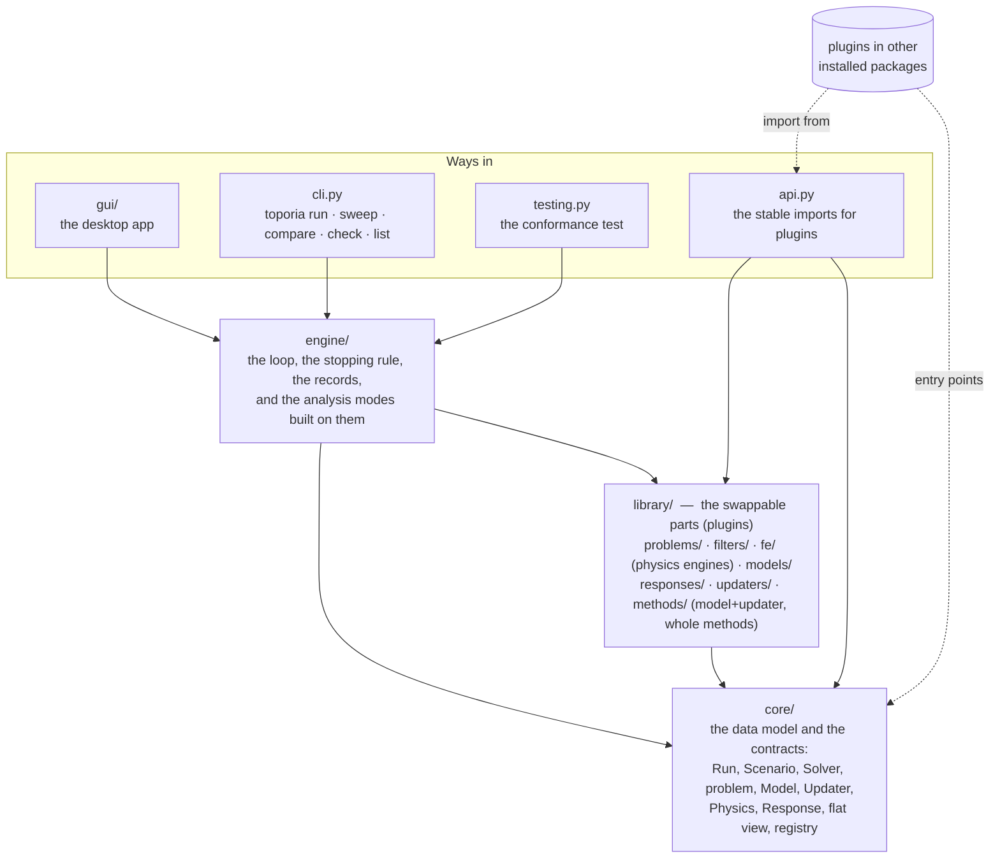
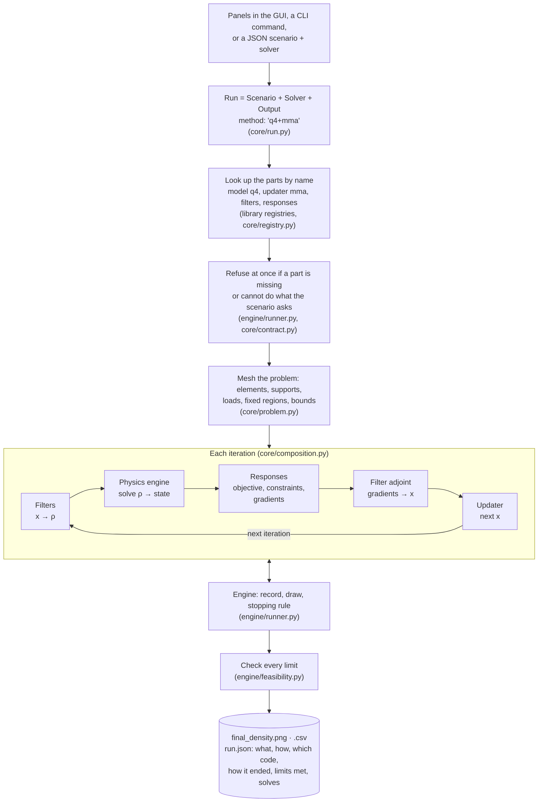

# `toporia` — the package

Toporia is a platform for topology optimisation in which **every choice is a swappable
part**: how the design is filtered, which physics is solved, what is minimised and
constrained, and how the design is updated. A run fixes the problem and names the parts;
the engine drives them all the same way, so two runs that differ in one part are a fair
comparison.

## The layers

An arrow means "uses". The arrows only point down: `core` uses nothing else in Toporia,
the `library` uses only `core`, and the `engine` uses both but is used by neither. A
plugin therefore never depends on how it is driven or displayed.

## What is where

| Path | What it is | Read |
| :--- | :--- | :--- |
| [`core/`](core/) | **The data model and the contracts.** What a run is (`Scenario`, `Solver`, `Run`, the meshed problem) and what every plugin must do (`OptimizationMethod`, `Model`, `Updater`, `Physics`, `Response`, the flat view, an outside optimiser's loop), plus parameter declarations and plugin discovery. No mathematics. | [core/README.md](core/README.md) |
| [`engine/`](engine/) | **The loop and the analysis modes.** Builds the method from a run, steps it, applies the one stopping rule, records history and `run.json`, checks the limits; and on top of that, sweeps, comparisons and sensitivity studies. | [engine/README.md](engine/README.md) |
| [`library/`](library/) | **The swappable parts.** Each subfolder is scanned for plugins, so adding one is adding a file. Each has a README that maps its part of the field: what is in Toporia, what exists elsewhere, what is paper only. | [library/README.md](library/README.md) |
| &nbsp;&nbsp;[`library/problems/`](library/problems/) | Benchmark presets: MBB beam, cantilever, three-point bending, bar, drone arms. | |
| &nbsp;&nbsp;[`library/filters/`](library/filters/) | Design → physical density, and the chain rule back: density, sensitivity, Heaviside, AM overhang, symmetry, routing. | |
| &nbsp;&nbsp;[`library/fe/`](library/fe/) | Finite-element solvers and the physics engines built on them: 2-D Q4 plane stress. | |
| &nbsp;&nbsp;[`library/models/`](library/models/) | What is optimised: `q4` (filters + Q4 engine + responses, assembled) and `pymoto_elastic` (a pyMOTO network). | |
| &nbsp;&nbsp;[`library/responses/`](library/responses/) | Objectives and constraints that compute themselves: compliance, volume, peak von Mises stress. | |
| &nbsp;&nbsp;[`library/updaters/`](library/updaters/) | How the design moves: OC, MMA, SiMPL, BESO, pyMOTO's MMA and GCMMA, SciPy's SLSQP. | |
| &nbsp;&nbsp;[`library/methods/`](library/methods/) | Names `"<model>+<updater>"` (any pair, built on demand) and the whole methods that do not split (the RBF level set). | |
| &nbsp;&nbsp;[`library/catalog.py`](library/catalog.py) | Every numeric value a given setup lets you sweep, as parameter paths — what the GUI's sweep and compare menus list. | |
| [`gui/`](gui/) | The desktop app: `app.py` starts Qt; `window.py` lays out the panels and the Run/Stop button; `widgets.py` and `param_form.py` generate every input from the plugins' declarations; `canvas.py` draws the live design and convergence; `config.py` turns the panels into a `Run`; `runner.py` calls the engine and routes its output to the log. | |
| [`api.py`](api.py) | **What a plugin imports.** The stable names for writing plugins, especially ones in other packages: the bases, `Param`, the registries, the flat view, the conformance test. | [docs/writing-plugins.md](../docs/writing-plugins.md) |
| [`testing.py`](testing.py) | **The conformance test.** `conformance(MyPlugin)` checks a plugin's interface, its gradients against finite differences and, for an updater, a benchmark against optimality criteria. Also `toporia check` and the GUI's *Check Parts* mode. | |
| [`cli.py`](cli.py) | The command line: `run`, `compare`, `sweep`, `check`, `list`, `export`; no command opens the GUI. | `toporia --help` |
| [`__init__.py`](__init__.py), [`__main__.py`](__main__.py) | Version, and `python -m toporia` = the `toporia` command. | |

## The life of a run

From a click on **Run** to the files on disk, and where each step lives:

The method in the middle can also be a whole method that does its own iteration (the
RBF level set), and the updater can be an outside library running its own loop in a
background thread (SciPy's SLSQP); to the engine they look the same.

## Extending it

| You want to add… | Write | Guide |
| :--- | :--- | :--- |
| an update rule, or wrap an optimiser library | an updater in `library/updaters/` | [docs/writing-plugins.md](../docs/writing-plugins.md) |
| a filter or fabrication rule | a filter in `library/filters/` | 〃 |
| an objective or constraint | a response in `library/responses/` | 〃 |
| a new physics or element | a physics engine in `library/fe/` and a three-line model | 〃 |
| a benchmark | a preset in `library/problems/` | [library/problems/README.md](library/problems/README.md) |
| any of these, without touching this repository | your own package with an entry point | [docs/writing-plugins.md](../docs/writing-plugins.md#packaging-outside-this-repository) |

Then `toporia check kind:name`, and mark it ✅ in the folder's README.
