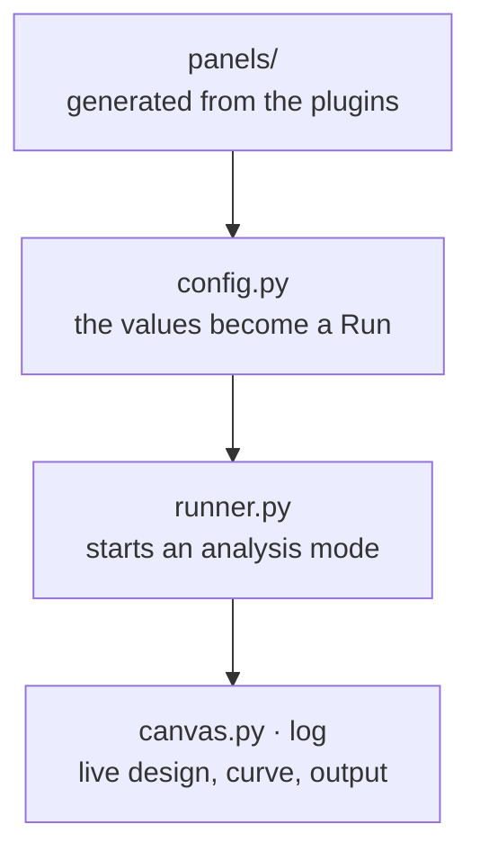

# `toporia/apps` — the desktop app and the command line

Neither contains optimisation logic. Both turn what the person chose into a
[`Run`](../framework/problem/run.py) and hand it to the [`engine`](../engine/README.md).

```
apps/
├── cli.py            the command line; with no command, the GUI
└── gui/
    ├── app.py        starts Qt (and sets matplotlib's Qt backend first)
    ├── window.py     the main window: lays out the panels, wires the Run/Stop button
    ├── canvas.py     the live design and convergence curve; a 3-D view at the end
    ├── config.py     the panels' values → a Run (cheap, so the Pipeline box can refresh)
    ├── runner.py     calls the engine's modes and routes their printed output to the log
    └── panels/       every input panel, one module each
        ├── method.py     volume, and the method: physics model + updater, or whole
        ├── design.py     representation, 2-D or 3-D, resolution and the mesh it gives
        ├── pipeline.py   the Pipeline box
        ├── specs.py      filters, objective, constraints, schedules
        ├── loads.py      load cases
        ├── modes.py      the settings of each analysis mode
        ├── forms.py      a form generated from Param declarations
        └── common.py     small shared widgets and helpers
```



Every input that comes from a plugin — a method's, filter's or response's parameters,
the list of models, updaters, filters, objectives, constraints — is generated from the
plugin classes, so a new plugin appears in the GUI and the CLI without editing anything
here. A plugin whose optional package is not installed is shown greyed out with the
install command.
