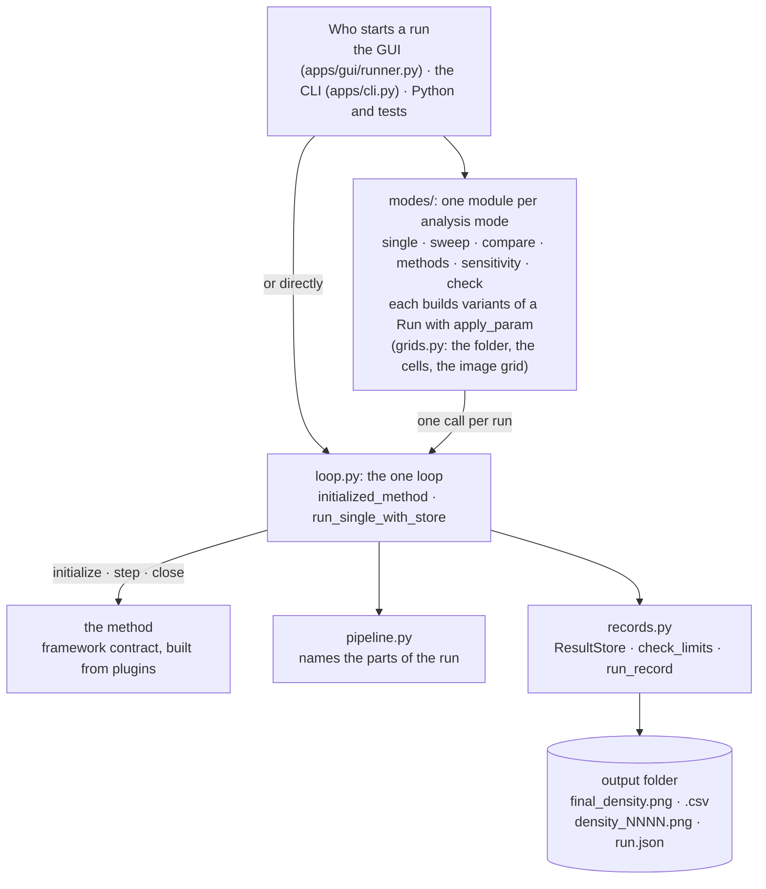
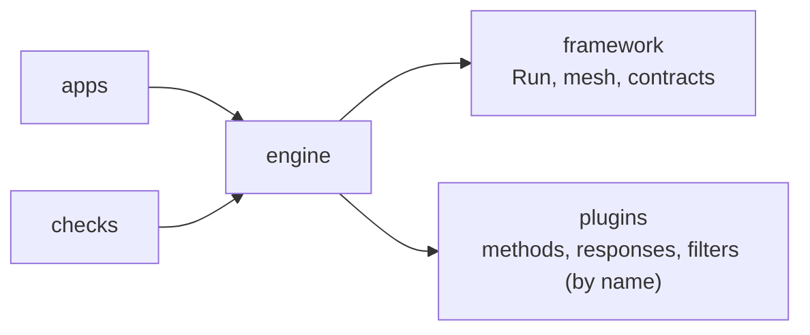

# `toporia/engine` — running things

The engine **runs** a [`Run`](../framework/problem/run.py): it builds the problem and the
method from it, drives the iterations, applies one stopping rule to every method, and
records what happened. Every analysis mode — one run, a sweep, a comparison, a
sensitivity study — is built on that one loop, so they all stop, record and report the
same way.

The engine knows methods only through
[`framework/parts/method.py`](../framework/parts/method.py). It does not know whether a
method is OC, BESO, SciPy's SLSQP or the level set; that is what keeps a cross-method
comparison fair.

```
engine/
├── loop.py         the one optimisation loop
├── records.py      what a run leaves behind: history, images, limit check, run.json
├── pipeline.py     names the parts of a run, for the console and the GUI
├── postprocess.py  applies the run's post-processors to the final design, or to a saved run
└── modes/          one module per analysis mode
    ├── single.py       Run One
    ├── sweep.py        Sweep, Sweep 2D
    ├── compare.py      Compare Two, Compare Load Cases
    ├── methods.py      Compare Methods, and `toporia benchmark`
    ├── sensitivity.py  Sensitivity, Sensitivity Sweep, Sensitivity Sweep 2D
    ├── check.py        Check Parts
    └── grids.py        what the multi-run modes share
```

## At a glance



## The files

| File | What it does |
| :--- | :--- |
| [`loop.py`](loop.py) | **The one optimisation loop.** `initialized_method(run)` looks the method up by name, refuses it before anything is computed if a package it needs is missing or it cannot do what the scenario asks (naming the methods that can), prints the pipeline, meshes the problem and initialises the method. `run_single_with_store(run, on_iteration)` steps it, records every iteration, calls the live callback (the GUI's canvas and Stop button), applies the stopping rule, always calls `method.close()`, checks the limits, and writes the results and `run.json`. `run_single(run)` returns just the final density. |
| [`postprocess.py`](postprocess.py) | **After the run.** `run_postprocessors` applies `run.output.postprocess` to the final design in order; files go to `<run>/post/` and the numbers into `run.json` under `"postprocess"`. One that fails is reported and the others still run. `check_postprocess` refuses an unknown or misconfigured one before the run starts. `postprocess_folder` does the same for a saved run (`toporia post`), from its `run.json`, `final_density.csv` and, for explicit geometry, `final_geometry.json`. `table_metrics` gives the numbers Compare Methods adds as columns. |
| [`records.py`](records.py) | **What a run leaves behind.** `ResultStore` keeps the per-iteration history (objective, volume, every reported response), writes density snapshots, `final_density.png`, `final_density.csv` and an optional `history.png`. `check_limits` judges the final design against the volume budget and every constraint (on the exact value when there is one, e.g. the true peak stress) and `describe_violations` turns broken ones into `WARNING:` lines. `run_record` builds `run.json`: scenario and solver with fingerprints, software versions and git commit, how the run ended, every limit, the final responses, and an outside optimiser's own verdict. |
| [`pipeline.py`](pipeline.py) | Names what a run is made of: design → filters → physics → objective, constraints → what the optimiser sees → updater, and why any part is unavailable. The console line at the start of every run and the GUI's **Pipeline** panel both come from here. |

### The analysis modes

Each mode builds variants of a `Run` with [`apply_param`](../framework/problem/run.py) — so
any parameter path can be swept, compared or perturbed — and sends each through the loop.

| File | GUI mode | What it produces |
| :--- | :--- | :--- |
| [`modes/single.py`](modes/single.py) | Run One | One optimisation, with a summary of the meshed problem first and `history.png` at the end. |
| [`modes/sweep.py`](modes/sweep.py) | Sweep · Sweep 2D | One parameter over an `n_rows × n_cols` grid, or two parameters (rows × columns); one run per cell; `sweep_grid.png` / `sweep2d_grid.png`. |
| [`modes/compare.py`](modes/compare.py) | Compare Two · Compare Load Cases | Two runs differing in one parameter, or in their load cases; `comparison.png` shows material only in A, only in B, and in both. `compare_runs` takes any two prepared runs (used by `toporia compare`). |
| [`modes/methods.py`](modes/methods.py) | Compare Methods · `toporia benchmark` | Several methods on the same scenario, mesh, filters and stopping rule (and, for a benchmark, on several problems): `methods_grid.png` with every final design, and `methods.csv` / `benchmark.csv` with each method's own objective, a **referee compliance** (every design measured the same way: Q4, SIMP p = 3, no filter), volume, grey level, iterations, physics solves, time, stop reason and whether every limit was met. A method that cannot solve the scenario is listed with the reason. |
| [`modes/sensitivity.py`](modes/sensitivity.py) | Sensitivity · Sensitivity Sweep (1-D, 2-D) | Runs at `base` and `base + gap` and maps `(ρ_perturbed − ρ_base) / gap` per element over the base design (`sensitivity.png`, `.csv`); the sweeps do that for every cell, and can also vary the base value or the gap (`senssweep_grid.png`, `senssweep2d_grid.png`). |
| [`modes/check.py`](modes/check.py) | Check Parts | No optimisation: the conformance test ([`checks/`](../checks/README.md)) on every part of the selected pipeline. |
| [`modes/grids.py`](modes/grids.py) | *(shared)* | The mode's output folder, running a list of cells with progress lines, and laying images out in one grid. |

## One run, step by step


**The stopping rule** is the same for every method, which is what makes two methods
comparable: stop when the design change reported by the method falls below `solver.tol`,
or at `solver.max_iter`. A method may add its own criterion (`is_converged()`, e.g. BESO's
objective-based test, or an outside library that has finished), and the reason is then
recorded instead of a generic message. Whatever ended the run is written to `run.json`.

**Continuation holds the stop.** Before each iteration the loop applies every schedule in
`solver.schedules` (`method.set_parameter(path, value)`) and records the values with the
history. Neither the tolerance nor a method's own criterion ends the run while a schedule
has not reached its end, or while a part's own continuation is still moving
(`method.continuing()`, e.g. the Heaviside β doubling). A design that has settled at p = 1
is not the answer at p = 3. A run that hits `max_iter` first names the unfinished schedules
in its stop reason.

**Every run writes**, in its output folder:

| File | Contents |
| :--- | :--- |
| `final_density.png` | the final design, greyscale |
| `final_density.csv` | the same as numbers, with two metadata rows |
| `density_NNNN.png` | snapshots every `save_every` iterations (0 = none) |
| `run.json` | provenance: what was solved, how, by which code version, how it ended, whether every limit was met, how many physics solves it took, and an outside optimiser's own verdict |

## What the engine depends on



The engine imports `framework` for the data model and the contracts, and looks methods,
responses and filters up in `plugins` by name. Nothing in `framework` or `plugins` imports
the engine, so a plugin never depends on how it is driven.
