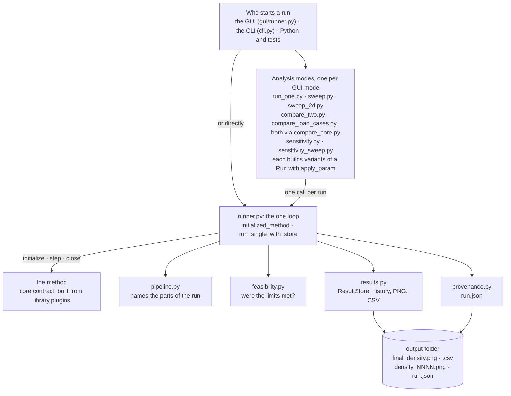
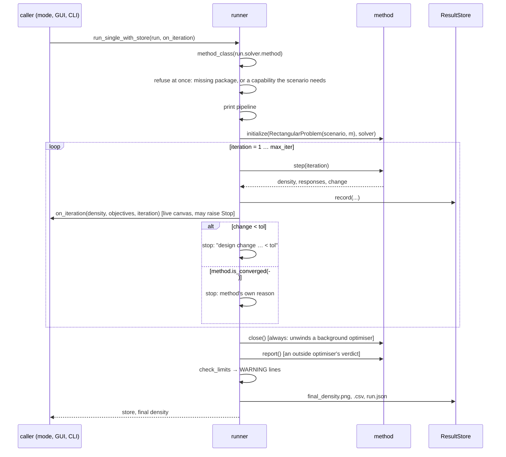
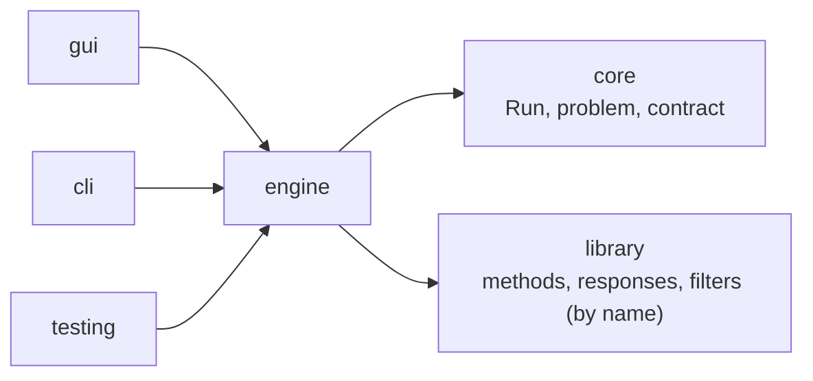

# `toporia/engine` — the optimisation loop and the analysis modes

The engine **runs** things. It takes a [`Run`](../core/run.py), builds the problem and the
method from it, drives the iterations, applies one stopping rule to every method, and
records what happened. Every analysis mode — one run, a sweep, a comparison, a
sensitivity study — is built on that one loop, so they all stop, record and report the
same way.

The engine knows methods only through the contract in
[`core/contract.py`](../core/contract.py). It does not know whether a method is OC, BESO,
SciPy's SLSQP or the level set; that is what keeps a cross-method comparison fair.

## At a glance

## The files

### The loop

| File | What it does |
| :--- | :--- |
| [`runner.py`](runner.py) | **The one optimisation loop.** `initialized_method(run)` looks the method up by name, refuses it before anything is computed if a package it needs is missing or it cannot do what the scenario asks (naming the methods that can), prints the pipeline, builds the `RectangularProblem` and initialises the method. `run_single_with_store(run, on_iteration)` steps it, records every iteration, calls the live callback (the GUI's canvas and Stop button), applies the stopping rule, always calls `method.close()`, checks the limits, and writes the results and `run.json`. `run_single(run)` returns just the final density. |
| [`pipeline.py`](pipeline.py) | Names what a run is made of: `pipeline_stages(run)` → design → filters → physics → objective, constraints → what the optimiser sees → updater. `describe_pipeline` is the console line, `pipeline_notes` the plain-language reasons why a part is unavailable (an updater that cannot enforce a constraint, a package not installed). The GUI's **Pipeline** panel shows exactly the same. |
| [`feasibility.py`](feasibility.py) | `check_limits(scenario, responses)` judges the final design against the volume budget and every scenario constraint (on the exact value when the method reports one, e.g. the true peak stress), with 1 % tolerance; `describe_violations` turns broken limits into the `WARNING:` lines. An optimiser that cannot meet every limit settles on a compromise without an error, so this is checked explicitly after every run. |
| [`provenance.py`](provenance.py) | `run_record(...)` — the `run.json` written next to every result: scenario and solver in full with their fingerprints, software versions and git commit, iterations, stop reason, feasibility, every limit, the final responses (including `solves`), and the outside optimiser's own verdict when there is one. |
| [`results.py`](results.py) | `ResultStore` — per-run history (objective, volume, every reported response per iteration), density snapshots every `save_every` iterations, `final_density.png` and `final_density.csv`, an optional `history.png`, and `save_json`. |

### The analysis modes

Each mode builds variants of a `Run` with [`apply_param`](../core/run.py) — so any
parameter path can be swept or compared — and sends each through the loop.

| File | Mode | What it produces |
| :--- | :--- | :--- |
| [`run_one.py`](run_one.py) | Run One | One optimisation; returns the `ResultStore` and the final density. |
| [`sweep.py`](sweep.py) | Sweep | One parameter over an `n_rows × n_cols` grid of linearly spaced values; one run per cell, assembled into `sweep_grid.png`. |
| [`sweep_2d.py`](sweep_2d.py) | Sweep 2D | Two parameters, one along the rows and one along the columns, to see how they interact; `sweep2d_grid.png`. |
| [`compare_core.py`](compare_core.py) | *(shared)* | Runs two prepared `Run`s and draws one overlay figure, `comparison.png`: material only in A, only in B, in both. |
| [`compare_two.py`](compare_two.py) | Compare Two | Two runs that differ in one parameter value. |
| [`compare_load_cases.py`](compare_load_cases.py) | Compare Load Cases | Two runs that differ only in their load cases. |
| [`sensitivity.py`](sensitivity.py) | Sensitivity | Runs at `base` and `base + gap` and maps `(ρ_perturbed − ρ_base) / gap` per element over the base design; `sensitivity.png` and a CSV. |
| [`sensitivity_sweep.py`](sensitivity_sweep.py) | Sensitivity Sweep (1-D, 2-D) | The sensitivity field for every cell of a sweep; can also sweep the base value or the gap itself; `senssweep_grid.png` / `senssweep2d_grid.png`. |

The GUI's eighth mode, **Check Parts**, runs the conformance test of
[`toporia/testing.py`](../testing.py) on the selected pipeline rather than an optimisation.

## One run, step by step

**The stopping rule** is the same for every method, which is what makes two methods
comparable: stop when the design change reported by the method falls below `solver.tol`,
or at `solver.max_iter`. A method may add its own criterion (`is_converged()`, e.g. BESO's
objective-based test, or an outside library that has finished), and the reason is then
recorded instead of a generic message. Whatever ended the run is written to `run.json`.

**Every run writes**, in its output folder:

| File | Contents |
| :--- | :--- |
| `final_density.png` | the final design, greyscale |
| `final_density.csv` | the same as numbers, with two metadata rows |
| `density_NNNN.png` | snapshots every `save_every` iterations (0 = none) |
| `run.json` | provenance: what was solved, how, by which code version, how it ended, whether every limit was met, how many physics solves it took, and an outside optimiser's own verdict |

## What the engine depends on

The engine imports `core` for the data model and the contract, and looks methods,
responses and filters up in `library` by name. Nothing in `core` or `library` imports the
engine, so a plugin never depends on how it is driven.
