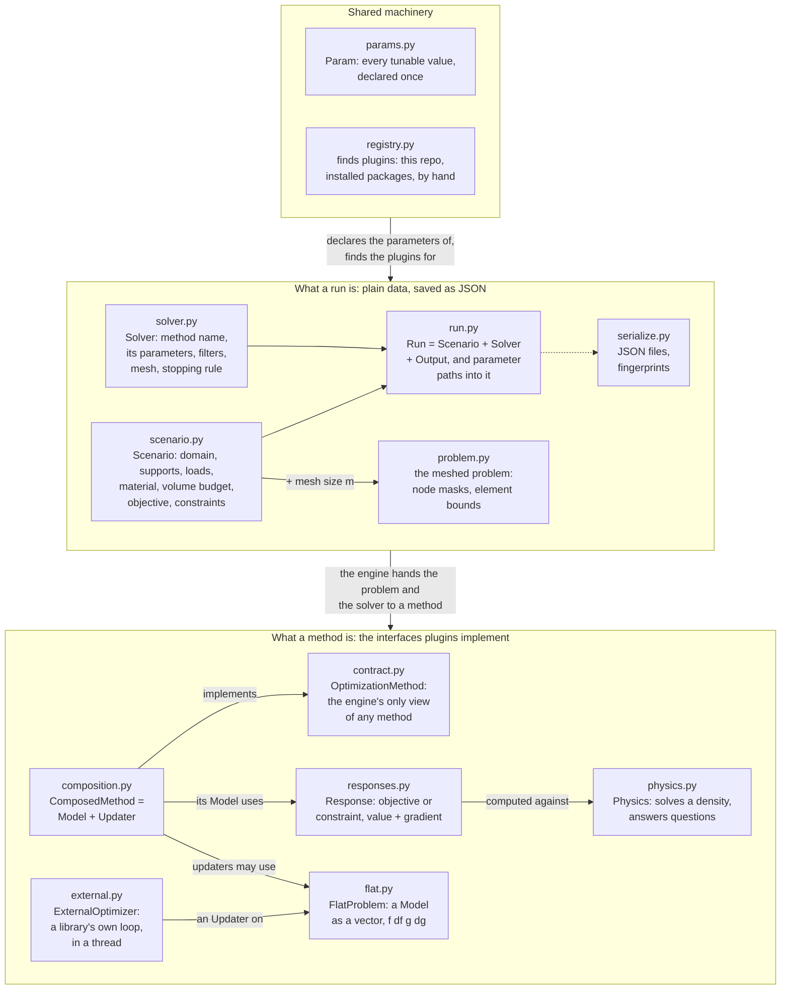
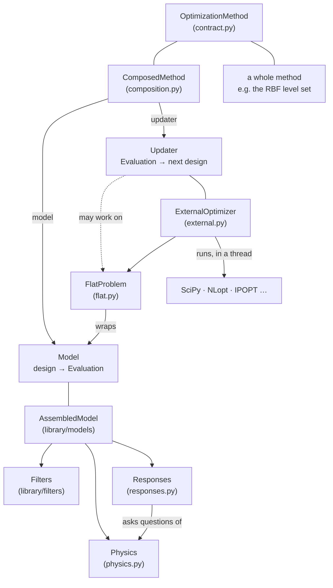
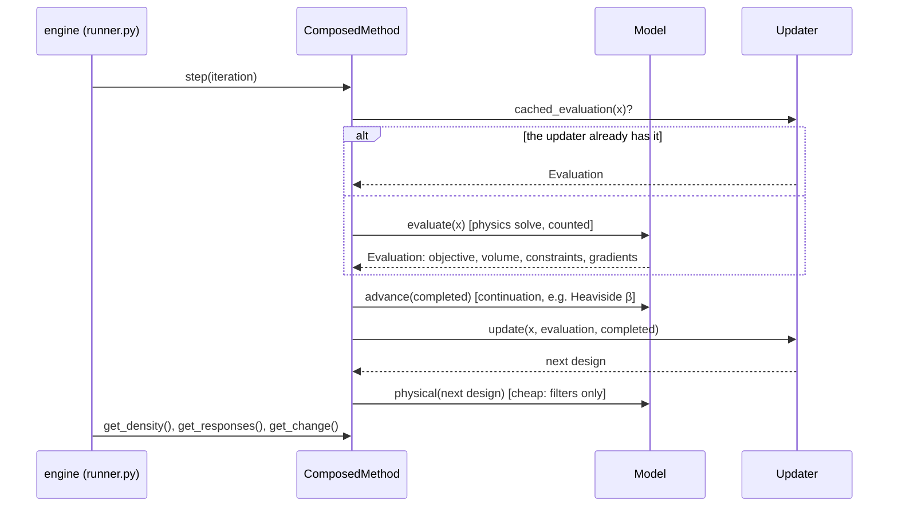
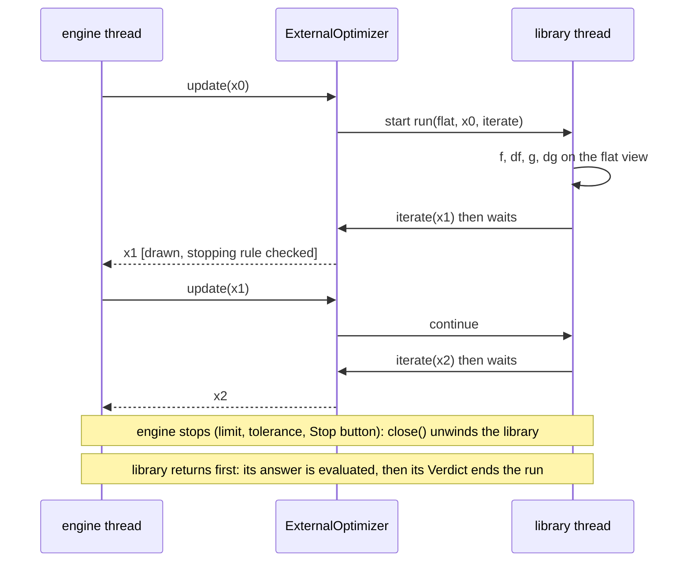
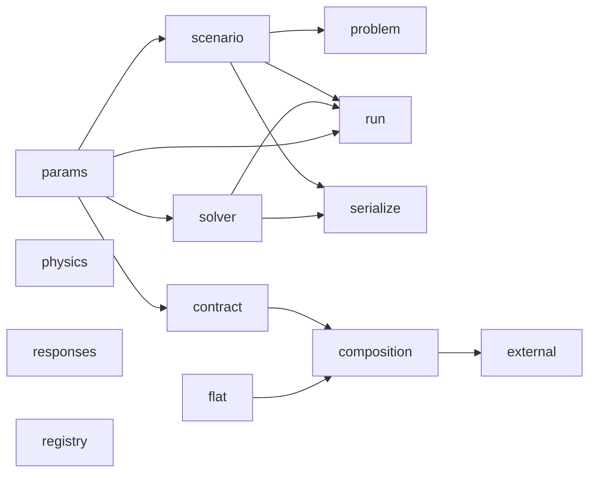

# `toporia/core` — the data model and the contracts

`core` defines **what a run is** and **what every plugin must do**. It contains no
topology-optimisation mathematics: no finite elements, no filter, no update rule. Those
live in [`library/`](../library/README.md), and the loop that drives them lives in
[`engine/`](../engine/README.md).

One rule keeps it readable: **nothing in `core` imports from `engine`, `library` or `gui`.**
Plugins are found by package name at lookup time ([`registry.py`](registry.py)), so the
dependency arrows only ever point *into* `core`.

## At a glance

Read it top to bottom: a **Run** describes a job as plain data; the engine builds the
**problem** from it and hands both to a **method**, which is usually a **Model** plus an
**Updater**; the model's numbers come from a **physics engine** and its **responses**; an
updater may see them through the **flat view**, or hand them to an outside library that
runs its own loop.

## The files

### What a run is

| File | Holds | Used by |
| :--- | :--- | :--- |
| [`scenario.py`](scenario.py) | `Scenario` — **what** is solved: domain `Lx × Ly` in mm, holes, enforced areas, edge and point supports, point loads, load cases (magnitude, angle, weight), material (`E0`, `Emin`, `nu`), volume budget `volfrac`, the `objective` and `constraints` as `{"type": …}` specs. Also `LoadCase`, `HoleConfig`, `EnforcedArea`, `EdgeConstraint`, `PointConstraint`, `PointLoad`, and `SCENARIO_PARAMS`. Frozen; plain data. | everything |
| [`solver.py`](solver.py) | `Solver` — **how** it is solved: `method` (`"q4+mma"`, `"levelset"`, …), `method_params`, `filter_specs`, mesh resolution `m` (elements per mm), `max_iter`, `tol`. Also `SOLVER_PARAMS`. | engine, GUI, CLI |
| [`run.py`](run.py) | `Run` = `Scenario` + `Solver` + `Output` (where results go), with `updated(...)` and `with_output_dir(...)`. **Parameter paths**: `apply_param(run, "filters[1].beta", 8)` / `read_param` address any single value — how sweeps, comparisons and the GUI change one thing at a time. | engine modes, GUI, CLI |
| [`problem.py`](problem.py) | `BaseProblem`, the geometry contract every solver reads, and `RectangularProblem`, which turns a `Scenario` at mesh size `m` into elements: `nelx × nely`, node masks for supports and loads, `passive_elements` / `void_elements`, and per-element `lower_bound` / `upper_bound`. No degree-of-freedom numbering — each physics engine brings its own. | engine (builds it), physics engines, models |
| [`serialize.py`](serialize.py) | `Scenario` and `Solver` ⇄ JSON (`save`, `load`, strict about unknown keys), and `fingerprint()`, a short hash meaning "same problem" or "same solver". | CLI, provenance (`run.json`) |

### What a method is

| File | Holds | Used by |
| :--- | :--- | :--- |
| [`contract.py`](contract.py) | `OptimizationMethod`, **the whole agreement between the engine and any method**: `initialize(problem, solver)`, `step(iteration)`, `get_density()`, `get_responses()`, `get_change()`, and the optional `is_converged()`, `convergence_reason()`, `report()`, `close()`. `Capabilities` says what a method can minimise and constrain, and `problems_with(scenario)` explains a mismatch before a run starts. | engine, every method |
| [`composition.py`](composition.py) | The split of a method into two independent choices. `Model` — **what** is optimised: design in, `Evaluation` out (objective, volume, constraints, all gradients; `evaluate(x, gradients=False)` skips them). `Updater` — **how** the design moves: `update(x, evaluation, completed)`. `ComposedMethod` joins any model with any updater and counts every physics solve; `compose(model, updater)` builds the pair named `"<model>+<updater>"`; `explain()` says in words what a pairing cannot do and why. | library models, updaters, methods; engine; GUI |
| [`physics.py`](physics.py) | `Physics` — a physics engine: `solve(density)` → state, plus the questions responses ask, grouped into features: `ELASTIC_ENERGY` (compliance, strain energy) and `STRESS` (element stress, adjoint solve, mutual energy). Displacements stay opaque, so responses never depend on a DOF numbering. | `library/fe` engines, `library/models/assembled.py`, responses |
| [`responses.py`](responses.py) | `Response` — a quantity to minimise (`OBJECTIVE_ROLE`) or limit (`CONSTRAINT_ROLE`): a declaration (name, roles, params) that usually also computes itself, `evaluate(state, gradient=True)` → `ResponseValue`, on every engine that `provides` the features it `requires`. | library responses, models, GUI, engine checks |
| [`flat.py`](flat.py) | `FlatProblem` — a model as optimisation libraries expect it: `x0`, `lower`, `upper`, `f`, `df`, `g`, `dg` (and `g_geq`, `dg_geq` for SciPy's sign), free variables only, the volume budget as the first constraint, optional objective scaling, one solve per point (cached). | MMA, pyMOTO and SciPy updaters, `external.py` |
| [`external.py`](external.py) | `ExternalOptimizer` — an `Updater` for a library that runs its own loop (SciPy, NLopt, IPOPT). Write `run(flat, x0, iterate)`; the library runs in a background thread and hands the engine one design per `iterate`, so the display, the stopping rule and the Stop button still work. Its `Verdict` (success, message, counts) goes to `run.json`. | SciPy SLSQP updater, plugin authors |

### Shared machinery

| File | Holds | Used by |
| :--- | :--- | :--- |
| [`params.py`](params.py) | `Param` — one tunable value, declared once next to the code that uses it (default, label, help, range, units). The GUI forms, the sweep menus and the config validation (`resolve_params`, which rejects unknown names) are all generated from these. | every plugin, GUI, engine |
| [`registry.py`](registry.py) | `Registry` — finds plugins in three ways: by scanning Toporia's own package, through the entry-point groups `toporia.models`, `.updaters`, `.filters`, `.responses`, `.methods` of installed packages, and by `register()`. A plugin that fails to load is recorded in `errors` while the rest still load. `missing_dependencies()` / `install_hint()` handle optional packages. | `library/*/__init__.py`, GUI, CLI, engine |
| [`__init__.py`](__init__.py) | Re-exports the names above, so `from toporia.framework import Run, Scenario, …` works. Plugins should import from [`toporia.api`](../api.py) instead. | everywhere |

## How a method is built from these pieces

Every arrow is an interface in this folder, so each box can be replaced without touching
the others: a new physics engine gets every response and filter for free, a new response
works on every engine that provides what it requires, and a new updater works with every
model.

## One iteration of a composed method

## An optimiser that runs its own loop

Only one of the two threads runs at any moment, so models need no locking.

## Imports inside `core`

An arrow means "is imported by". `physics`, `responses` and `registry` stand alone.

## Changing something here

`core` is what every plugin is written against, and what [`toporia.api`](../api.py)
re-exports for plugins in other packages. A change to a class or method named in the
tables above can break plugins outside this repository; prefer adding an optional method
with a default (as `report()` and `close()` were added) over changing an existing one.
