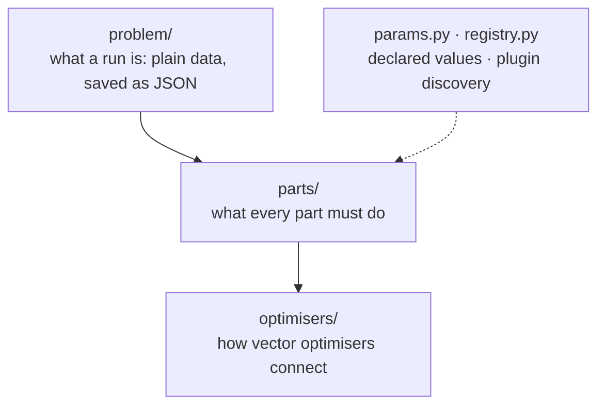
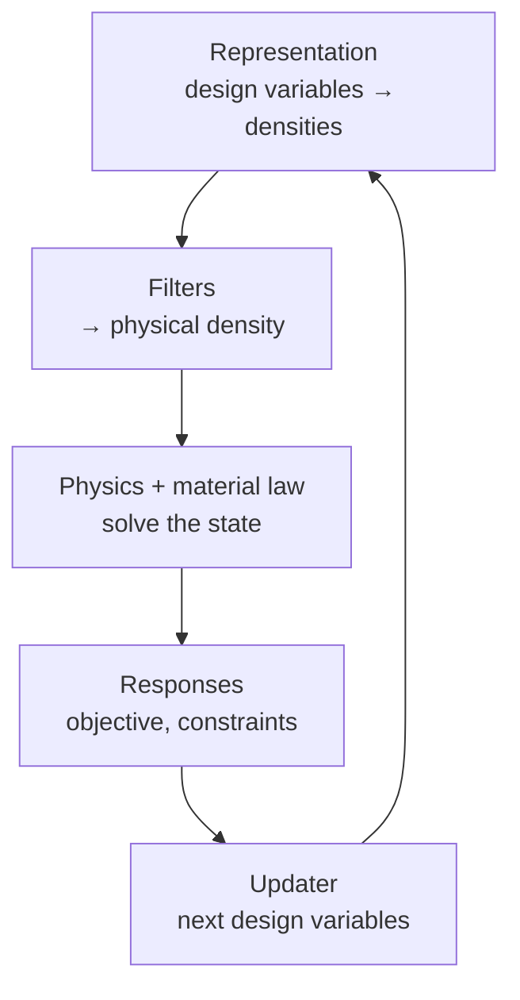
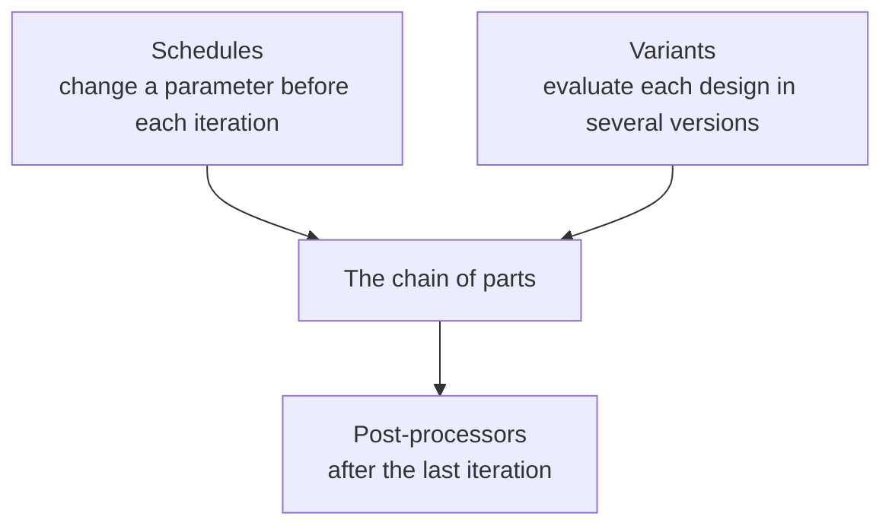
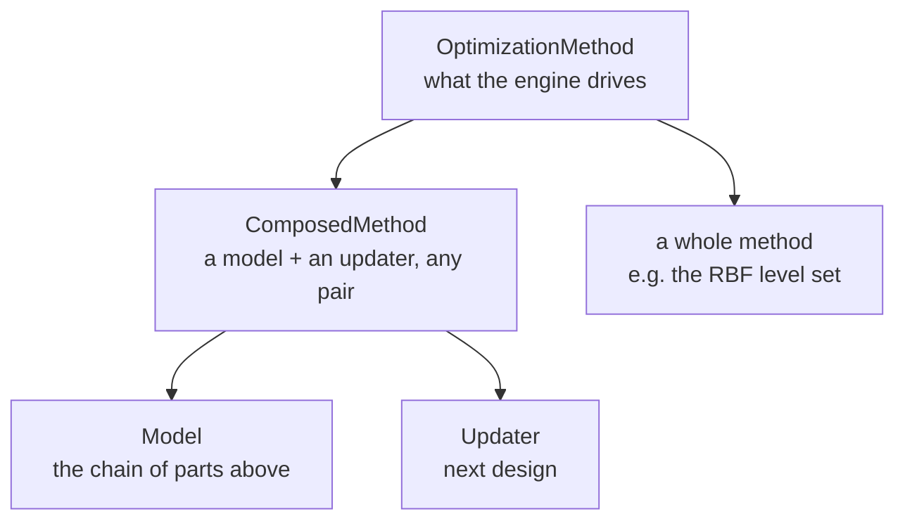
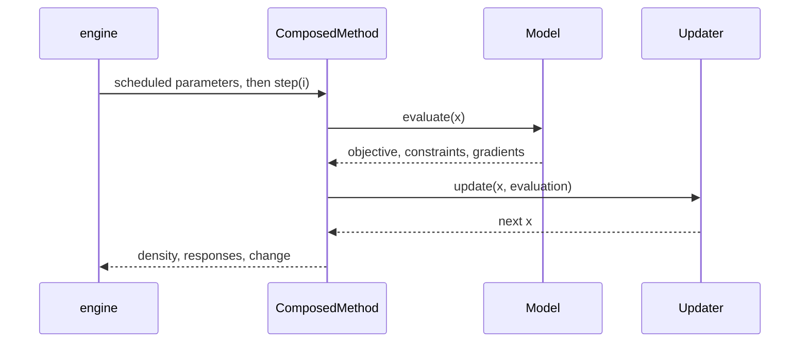
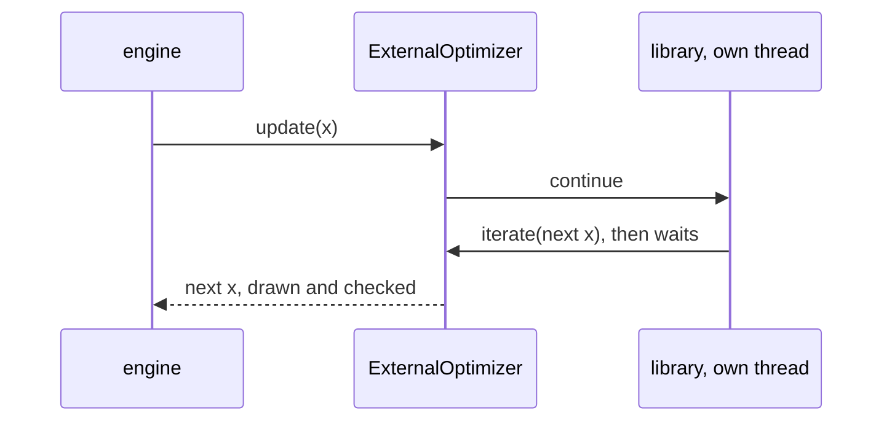

# `toporia/framework` — the rules

`framework` defines **what a run is** and **what every part must do**. It contains no
topology-optimisation mathematics: no finite elements, no filter, no update rule. Those
live in [`plugins/`](../plugins/README.md), and the loop that drives them lives in
[`engine/`](../engine/README.md).

One rule keeps it readable: **nothing in `framework` imports from `engine`, `plugins` or
`apps`.** Plugins are found by package name at lookup time ([`registry.py`](registry.py)),
so the dependency arrows only ever point *into* `framework`.

```
framework/
├── problem/       WHAT is solved, and how a run is described
│   ├── scenario.py    the physical problem
│   ├── mesh.py        the scenario meshed at a resolution
│   ├── solver.py      how it is solved: method, parameters, filters, mesh, stopping rule
│   ├── run.py         Run = Scenario + Solver + Output, and parameter paths
│   └── files.py       Scenario and Solver as JSON, and fingerprints
├── parts/         WHAT EVERY PART MUST DO — one file per interface
│   ├── method.py      OptimizationMethod: the engine's only view of any method
│   ├── model.py       Model: a design in, objective, constraints and gradients out
│   ├── updater.py     Updater: those numbers in, the next design out
│   ├── composition.py ComposedMethod = Model + Updater, for any pair
│   ├── physics.py     Physics: an engine that solves a density and answers questions
│   ├── response.py    Response: an objective or constraint, value and gradient
│   ├── representation.py  Representation: design variables → element densities (MMC, ...)
│   ├── filter.py      Filter: design → physical density, and the chain rule back
│   ├── interpolation.py  Interpolation: density → stiffness (SIMP, RAMP, ...)
│   ├── schedule.py    Schedule: a parameter that changes during the run (continuation)
│   ├── postprocess.py PostProcessor: what is made of the finished design
│   └── variants.py    VariantModel: one design in several versions (robust)
├── optimisers/    HOW OPTIMISERS WRITTEN FOR VECTORS CONNECT
│   ├── flat_view.py     a Model as x0, bounds, f, df, g, dg
│   └── external_loop.py a library that runs its own loop, in a background thread
├── params.py      Param: every tunable value, declared once
└── registry.py    finds plugins: here, in installed packages, or by hand
```

## At a glance



A **Run** describes a job as plain data. The engine meshes the problem from it and hands
both to a method built from the **parts**. An updater written for vectors sees the model
through the **optimisers** folder. Every tunable value is a declared `Param`, and the
registry finds every plugin.

## One evaluation: the chain of parts



Each box is one interface in `parts/` and one folder in `plugins/`. The gradients run back
up the same chain: each part carries the sensitivity of the one below it back to its
input. So any box can be swapped without touching the others.

## Around the chain



Schedules (continuation) and variants (robust design) are chosen in the solver;
post-processors in the run's output section. None of them changes a part.

## `problem/` — what a run is

| File | Holds | Used by |
| :--- | :--- | :--- |
| [`scenario.py`](problem/scenario.py) | `Scenario` — **what** is solved: domain `Lx × Ly` in mm (and a depth `Lz`, 0 for 2-D), holes, enforced areas, edge and point supports, point loads, load cases (magnitude, angle, weight), material (`E0`, `Emin`, `nu`), volume budget `volfrac`, the `objective` and `constraints` as `{"type": …}` specs. Also `LoadCase`, `HoleConfig`, `EnforcedArea`, `EdgeConstraint`, `PointConstraint`, `PointLoad`, and `SCENARIO_PARAMS`. Frozen; plain data. | everything |
| [`mesh.py`](problem/mesh.py) | `BaseProblem`, the geometry every solver reads; `RectangularProblem`, which turns a `Scenario` at mesh size `m` into elements: `nelx × nely`, node masks for supports and loads, `passive_elements` / `void_elements`, and per-element `lower_bound` / `upper_bound`; and `BoxProblem`, the same scenario extruded to its depth `Lz` in `nelx × nely × nelz` bricks (holes through it, supports and loads through the thickness). `make_problem(scenario, m)` picks the one the scenario asks for; every element field has `problem.shape` and `problem.dims` says 2 or 3. `projection(field)` is the 2-D picture of a field (its depth average in 3-D). No degree-of-freedom numbering — each physics engine brings its own. | engine, physics engines, models |
| [`solver.py`](problem/solver.py) | `Solver` — **how** it is solved: `method` (`"q4+mma"`, `"levelset"`, …), `method_params`, `filter_specs`, mesh resolution `m` (elements per mm), `max_iter`, `tol`. Also `SOLVER_PARAMS`. | engine, apps |
| [`run.py`](problem/run.py) | `Run` = `Scenario` + `Solver` + `Output` (where results go), with `updated(...)` and `with_output_dir(...)`. **Parameter paths**: `apply_param(run, "filters[1].beta", 8)` / `read_param` address any single value — how sweeps, comparisons and the GUI change one thing at a time. | engine modes, apps |
| [`files.py`](problem/files.py) | `Scenario` and `Solver` ⇄ JSON (`save`, `load`, strict about unknown keys), and `fingerprint()`, a short hash meaning "same problem" or "same solver". | CLI, `run.json` |

## `parts/` — what every part must do

| File | Holds | Implemented by |
| :--- | :--- | :--- |
| [`method.py`](parts/method.py) | `OptimizationMethod`, **the whole agreement between the engine and any method**: `initialize(problem, solver)`, `step(iteration)`, `get_density()`, `get_responses()`, `get_change()`, and the optional `is_converged()`, `convergence_reason()`, `report()`, `close()`. `Capabilities` says what a method can minimise and constrain, and `problems_with(scenario)` explains a mismatch before a run starts. | `ComposedMethod`, the level set |
| [`model.py`](parts/model.py) | `Model` — **what** is optimised: `evaluate(x)` gives an `Evaluation` (objective, volume, constraints, all gradients; `gradients=False` skips them), plus `bounds()`, `physical(x)`, the cheap `volume_of(x)`, and `advance()` for continuation. | `plugins/models` |
| [`updater.py`](parts/updater.py) | `Updater` — **how** the design moves: `update(x, evaluation, completed)` → the next design, with the optional hooks a method has (`is_converged`, `report`, `close`) and `flat_problem(model)` for updaters that work on a vector. | `plugins/updaters` |
| [`composition.py`](parts/composition.py) | `ComposedMethod` joins any model with any updater, in the one order that matters (evaluate → advance → update → physical), and counts every physics solve. `compose(model, updater)` builds the pair named `"<model>+<updater>"`; `explain()` says in words what a pairing cannot do and why. | — |
| [`physics.py`](parts/physics.py) | `Physics` — a physics engine: `solve(density)` → state, plus the questions responses ask, grouped into features: `ELASTIC_ENERGY` (compliance, strain energy) and `STRESS` (element stress, adjoint solve, mutual energy). Displacements stay opaque, so responses never depend on a DOF numbering. | `plugins/physics` |
| [`response.py`](parts/response.py) | `Response` — a quantity to minimise (`OBJECTIVE_ROLE`) or limit (`CONSTRAINT_ROLE`): a declaration (name, roles, params) that usually also computes itself, `evaluate(state, gradient=True)` → `ResponseValue`, on every engine that `provides` the features it `requires`. | `plugins/responses` |
| [`representation.py`](parts/representation.py) | `Representation` — what the design variables are: `density(z)` gives the element density field and `backward(z, sensitivity)` carries the gradient back; `initial()` and `bounds()` give the start design and the variables' range. Chosen in the solver (`solver.representation`); `element_wise` says whether the variables are the element densities themselves, and an updater that needs them (`needs_element_densities`: OC, BESO, SiMPL) is refused with any other. | `plugins/representations` |
| [`interpolation.py`](parts/interpolation.py) | `Interpolation` — the material law: `stiffness(ρ, E0, Emin)` and its `slope`, element-wise. Chosen in the solver (`solver.interpolation`) like the filters, and handed to every physics engine that declares `uses_interpolation`. | `plugins/interpolations` |
| [`schedule.py`](parts/schedule.py) | `Schedule` — continuation: `value(completed)` and `finished(completed)` for one parameter path. Chosen in the solver (`solver.schedules`); every part lists the parameters that may change mid-run in `schedulable`, and `change_parameter()` sets one on a live part. Models and methods route a path to the part that owns it with `set_parameter(path, value)`, and say whether a continuation of their own is still moving with `continuing()`. | `plugins/schedules` |
| [`postprocess.py`](parts/postprocess.py) | `PostProcessor` — `process(result)` returns metrics and writes files through `result.file(name)`; `Result` carries the final density, the meshed problem, the run, the folder, explicit geometry when the representation has it, and the black-and-white design once a threshold made one (`solid()`). Chosen in the run's Output section (`output.postprocess`), never changing the optimisation. | `plugins/postprocessors` |
| [`variants.py`](parts/variants.py) | `VariantModel` — the same model built once per value of one parameter path (`solver.variants`), evaluated together and joined into one `Evaluation`: the worst case (a smooth maximum with an exact gradient) or the mean. The robust eroded / intermediate / dilated formulation, uncertain loads. Built by `ComposedMethod` when the solver asks for it; updaters see one model. | `ComposedMethod` |
| [`filter.py`](parts/filter.py) | `Filter` — `forward(x)`, `backward(x_in, sensitivity)`, `step(iteration)` for continuation, and `FilterChain`, which runs several in order with one consistent backward pass. | `plugins/filters` |

## `optimisers/` — how optimisers written for vectors connect

| File | Holds | Used by |
| :--- | :--- | :--- |
| [`flat_view.py`](optimisers/flat_view.py) | `FlatProblem` — a model as optimisation libraries expect it: `x0`, `lower`, `upper`, `f`, `df`, `g`, `dg` (and `g_geq`, `dg_geq` for SciPy's sign), free variables only, the volume budget as the first constraint, optional objective scaling, one solve per point (cached). | MMA, pyMOTO and SciPy updaters |
| [`external_loop.py`](optimisers/external_loop.py) | `ExternalOptimizer` — an `Updater` for a library that runs its own loop (SciPy, NLopt, IPOPT). Write `run(flat, x0, iterate)`; the library runs in a background thread and hands the engine one design per `iterate`, so the display, the stopping rule and the Stop button still work. Its `Verdict` (success, message, counts) goes to `run.json`. | SciPy SLSQP updater |

## Shared machinery

| File | Holds | Used by |
| :--- | :--- | :--- |
| [`params.py`](params.py) | `Param` — one tunable value, declared once next to the code that uses it (default, label, help, range, units). The GUI forms, the sweep menus and the config validation (`resolve_params`, which rejects unknown names) are all generated from these. | every plugin, apps, engine |
| [`registry.py`](registry.py) | `Registry` — finds plugins in three ways: by scanning Toporia's own package, through the entry-point groups `toporia.models`, `.updaters`, `.representations`, `.filters`, `.interpolations`, `.responses`, `.schedules`, `.postprocessors`, `.methods` of installed packages, and by `register()`. A plugin that fails to load is recorded in `errors` while the rest still load. `missing_dependencies()` / `install_hint()` handle optional packages. | `plugins/*/__init__.py`, apps, engine |
| [`__init__.py`](__init__.py) | Re-exports the most used names, so `from toporia.framework import Run, Scenario, …` works. Plugins import from [`toporia.api`](../api.py) instead. | everywhere |

## How a method is built from these pieces



Every arrow is an interface in this folder. A new physics engine gets every response and
filter for free, a new response works on every engine that provides what it requires, and
a new updater works with every model.

## One iteration of a composed method



## An optimiser that runs its own loop



The library waits while the engine draws and checks each design, and the engine waits
while the library computes, so models need no locking. When the engine stops (limit,
tolerance, Stop button), `close()` unwinds the library; when the library finishes first,
its `Verdict` ends the run.

## Changing something here

`framework` is what every plugin is written against, and what [`toporia.api`](../api.py)
re-exports for plugins in other packages. Prefer adding an optional method with a default
(as `report()`, `close()` and `Filter.step()` were added) over changing an existing one.
